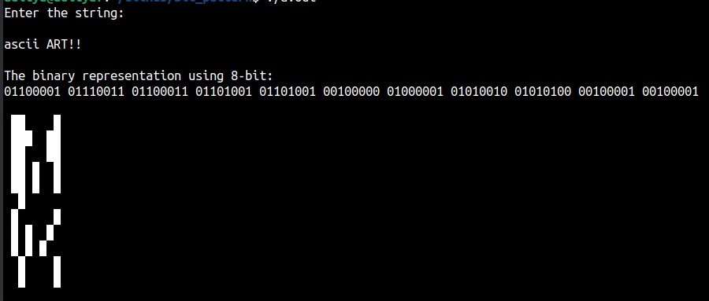
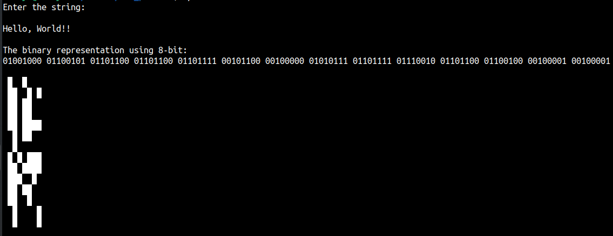

A simple program to represent each character from a user provided string in a bit pattern.

It presents the 8-bit representation of each character in a single row. The 1's in the 8-bit are represented using full block character (Unicode hex value: 2588), and the 0's are represented using " ". 

Few examples:

I conceived this bit representation of strings when I read this blog:

https://www.johndcook.com/blog/2021/04/28/powers-of-3-in-binary/
